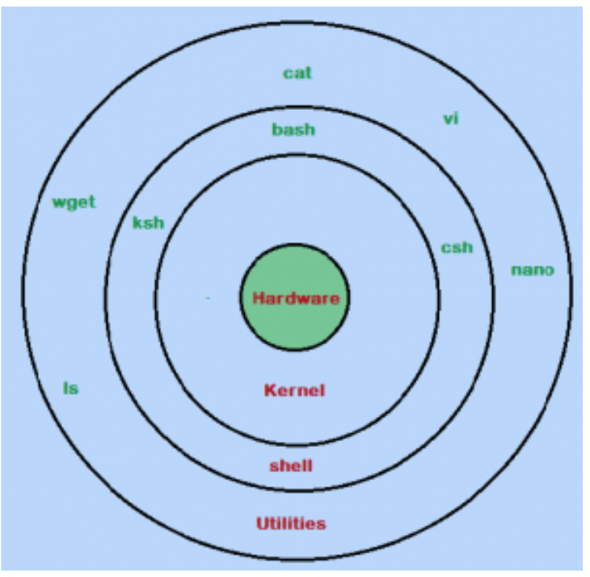

# Introduction to Linux shell

- If you are using any major operating system which means you are indirectly interacting to shell

- If you are using any other Linux distribution, you are interacting to shell every time you use terminal

- We might need to understand 3 major components here

## Kernel

- Kernel is a computer program that's the core of a OS, with has complete control over hardware components

- It also manages following resources of the Linux system. File management

    * Process management
    * I/O management
    * Memory management Device management etc

## Shell

- A shell is special program which provide an interface to user to use operating system services

- Shell accept human readable commands from user and convert them into binary which kernel can understand

- It's command language interpreter that reads commands input devices such as keyboards or from files

- The shell gets started when the user logs in or start the terminal

- Shell is broadly classified into two categories 

    * Command Line Shell
    * Graphical shell

## Command Line shell

- Shell can be accessed by user using a command line interface

- Tools used

    * Terminal in linux/macOS 
    * Command Prompt in Windows OS 

- From there tools we can provided human readable commands such as “cat”, “ls” etc to execute

- The result is then displayed on the terminal to the user

- Working in commands  in shell is bit difficult for beginners because it’s hard to memorize so many commands

- It allows user to store commands in file & execute them together, This way repetitive task can be easily automated

- These files are usually called batch files in Windows and Shell Scripts in Linux/macOS systems

## Graphical shell

- Graphical shells provides, graphical user interface (GUI), by allowing operations such as opening, closing, moving & resizing windows

- Window or Ubuntu OS can be considered as good example which provide GUI to user for interacting with program

- User do not need to type in command for every actions

## Types of Linux shells 

* BASH (Bourne Again SHell)

    - It is most widely used shell in Linux systems
    - It is used as default login shell in Linux systems and in macOS. It can also be installed on Windows OS

* CSH (C SHell)

    - The C shell’s syntax and usage are very similar to the C programming language

* KSH (Korn SHell)

    - The Korn Shell also was the base for the POSIX Shell standard specifications etc

## Note : Each shell does the same job but understand different commands and provide different built in functions