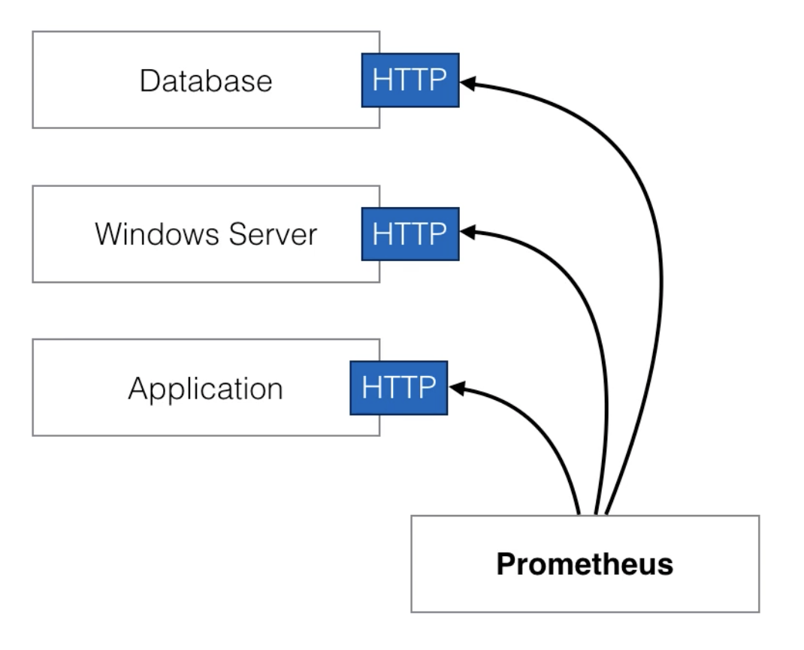

# Introduction

* prometheus is an `open source monitoring solution`

* started at around 2012-2013 and was made public in early 2015

* prometheus provides `metrics & alerting`

* it's inspired by Google's Borgmon, which uses time-series data as source, and alert based on this data

* prometheus considers as best fit for `cloud native infrastructure`

* in prometheus we talk about `Dimensional data`
  - time series are identified by metric name and set of key/value pairs
  - example :
    | Metric name | Label   | Sample |
    | ----------- | --------| ------ |
    | Temperature | location| 90     |

* prometheus also has flexible query language

* visualization can be shown using a built-in browser or with integrations like `Grafana`

* it stores metrics in `memory` and `localdisk` in an own custom, efficient format

* prometheus is completely written in Go programming language

* prometheus also allows many client libraries and integrations which makes it more flexible

# How does promethus work ?

* prometheus collects metrics from targets by scrapping using HTTP protocol

* scrapping endpoints is much more efficient then other mechanisams

* For instance, one single prometheus server can ingest upto one million samples per seconds

