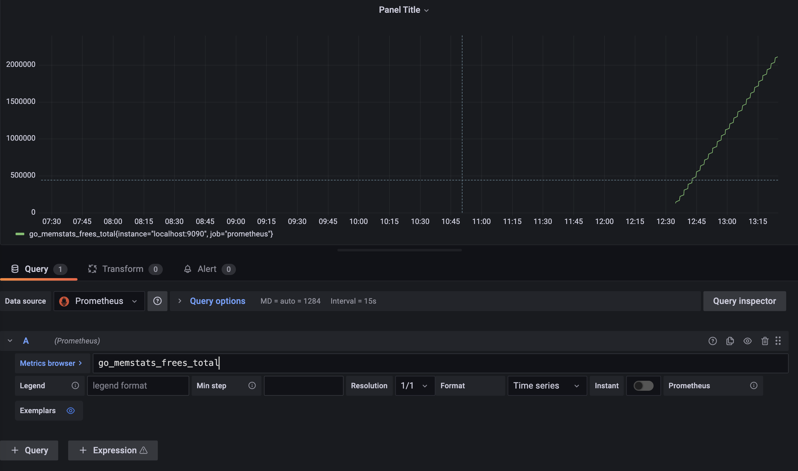

# Grafana

* As we saw prometheus has pretty basic dashboard everyone tend to use Grafana along with prometheus as mainstream dashboard

* Grafana enables nicer dashboard and better visualizations

# Grafana installation

* Install grafana using script in scripts folder

# Validation post install

* check if grafana is installed

-  ps aux | grep grafana
-  http://<ipaddress>:3000
-  default username/password : admin/admin

# Add data source

* select add datasource from grafana dashboard
* select `prometheus` as datasource
* add url which is pointing to local prometheus datasource
* http://localhost:9090

# Add dashboard

* click on add dash board
* select prometheus from query datasource
* copy any metrics from prometheus dashboard and paste here to get graphs

