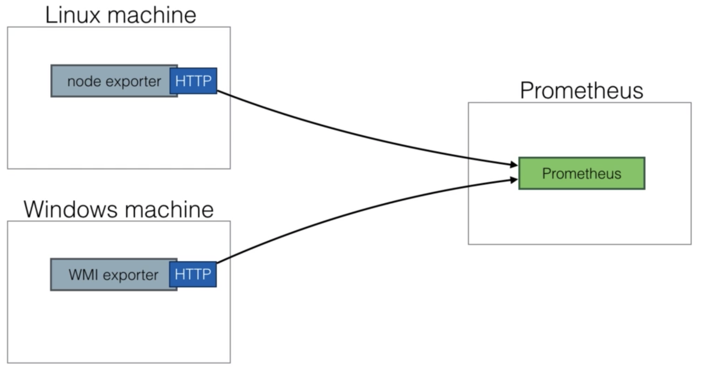

# Node exporter

* To monitor nodes, you need to install the node exporter

* The node exporter will expose machine metrics of linux machines

  For example : cpu usage, memory usage

* Node exporter can be used to monitor machines & later on, you can create alerts based on ingested metrics

* For windows, there's a WMI exporter to do the same task

# Node exporter install 

* use node exporter script `node-exporter.sh` to install node exporter in target machines

* once node exporter is installed in end point just copy job and add under your `prometheus.yml` file 

# Reload prometheus 

* `kill -HUP <process-number>`

* once done you should be able to see new exporter under targets

* you can either view it in prometheus dashboard or you can create new dashboard in grafana
